### Oversikt over struktur
1. [*KOMPLEKSE IKT-SYSTEMER*](#del1)
2. [*OPPSUMMERING AV NETTVERKSPROTOKOLLER OG OSI-MODELLENk*](#del2)
3. [*NETTVEKSTOPOLOGIER*](#del3)
4. [*KOMPLEKSE IKT-SYSTEMER (igjen??)*](#del4)
5. [*IKT-SYSTEM OG KRITISK INFRASTRUKTUR*](#del5)
7. [*TAKSONOMI*](#del6)
8. [*Parallelle datamaskinar*](#del7)
9. [*Operativsystem og maskinvaregrensesnitt*](#del8)
10. [*Datamaskinnettverk*](#del9)
11. [*Framtidige trender*](#del10)
12. [*Oppsummering*](#oppsummering)
13. [*Alt man trenger å vite...*](#christianskokebok)

# Komplekse IKT systemer

**IKT systemer:**

- Et IKT system består av informasjon, tjenester, nettverk, software, hardware og databaser. Mange ulike komponenter.

**Informasjon:**

- Informasjon er en viktig del av et IKT system.
- Data refererer vanligvis til rå data, eller ubehandlede data. Når dataen er analysert, regnes det som som informasjon. Informasjon er “kunnskap formidlet eller mottatt angående et bestemt forhold”, aka ✨Informasjon er data satt sammen✨.

*Vital information, personal information, strategic information, high-cost information.*

*Hvilken informasjon er viktig for deg?* 

**Tenester:** 

I dag bruker alle organisasjoner digitale tenester. Dette er en viktig del av et digitalt system. Tjenester benytter, produserer, leverer, etc… 🔥`INFORMASJON`🔥 Eksempler på tjenester; Sosiale medier, skylagring, dokumentredigering, videokonferanser, betalingstjenester, strømmetjenester, søkemotorer.

*Tjenester har ulike “formål”: Nødvendig pga juridiske krav, nødvendig for å beskytte målet og gjennomførelsen til organisasjonen. Tjenester som inneholder hemmelig info.* 

*Hvilke tjenester er viktige for deg?* 

Menneskelige presentasjoner, tekniske systemer og organisatoriske forhold er alle relevante aspekter av et sikkert og robust IKT system.

*But whyyyyyy?????*

Storytime: 

To personer snakker sammen via Skype (feks). ******************Informasjonen****************** som transmitteres her kan være taletrafikk, filer, video, chattemeldinger, etc… Informasjonen sendes gjennom et datanettverk i form av *data* (bits og bytes). Skype er en digital ****************tjeneste**************** som tilbyr transimisjon av slik informasjon.  I bunn er det et ************IKT system************ som muliggjør dette.

Flere kombinasjoner:

- H2H
- H2M
- M2M

****************Hvilke kommunikasjonstjenester bruker du? Hvordan vil du klassifiserer/beskrive de ulike komboene?****************

# Oppsummering av nettverksprotokoller og OSI modellen

**Packets og routing**

Når du sender en melding blir den sendt via en forbindelse som er konstruert av faktiske fysiske komponenter (rutere, servere, fiberkabler, etc.) som er koblet sammen i et nettverk. Det er viktig å skjønne forskjellen mellom logiske og fysiske komponenter. Fysiske forbindelser (nettverk) gjør det mulig å opprette logiske forbindelser. 

Når du sender eller mottar informasjon på internett, sendes det “pakker” mellom mange maskiner (rutere). Før informasjonen sendes, deles den opp i pakker. Hver pakke er merket med avsender og mottakeradresse (IP adresse). Hver gang eg pakke kommer til en ruter, ser ruteren hvilken adresse pakken skal sendes til. Deretter slår den opp i en routing tabell, og  finner beste vei frem til mottakeren. Ruteren vet ingenting om hvor din pakke ender opp, det eneste den vet er hva som er beste vei. 

De forskjellige pakkene trenger ikke å ta samme vei for å komme frem til målet. Det er ikke sikkert at pakkene kommer frem i samme rekkefølge som de ble sendt. Dersom en ruter “går ned”, kan man alltids sende pakkene en annen vei. Dette gjør at Internett er en svært robust kommunikasjonsinfrastruktur.

**********************************Hva er forskjellen mellom denne typen nettverk og et klassisk telefoni-nettverk fra “gamle dager”?********************************** 

************************Protokoller************************

- En protokoll er et sett med regler som forteller hvordan man skal utveksle informasjon over ett nettverk.
- Nødvendig for å få forskjellige typer av utstyr å “snakke samme språk”.
- Eksempler på protokoller: TCP, IP, HTTP, TLS, ARP, BGD, DNS, DHCP, FTP, UDP, OSPF, SSH, SSL, SMTP, Telnet. Alle disse protokollene har sine egne styrker og svakheter. For å skjønne hvordan “ditt” digitale system er sårbart, må du vite hvordan det er konstruert. Altså, hvilke protokoller som er implementert.

******************************The layers of communication******************************

- OSI stacken er en konseptuell modell for digital kommunikasjon.
- Modellen beskriver hvordan forskjellige protokoller settes sammen for å transportere informasjon.
- Alle lagene tilbyr tjenester til det neste, (og mottar fra forrige).

************************************The layers of computing************************************

- Hardware omfatter fysiske komponenter
    - harddisk
    - I/O
    - printer
- Software omfatter programmer som “kjører på” hardwaren
    - Apper
    - Programmer
    - OS
    - Databaser
- Firmware er programvaren i minnet til maskinvaren

# Nettverkstopologier

**********************************************************Peers connected to a network:**********************************************************

Et kommunikasjonsnettverk er vel ikke så komplisert? Når vi ser på hvordan det brukes,
og det som er synlig for oss, det ser superenkelt ut. Men, er det virkelig så enkelt....?

Vel, du vet allerede at det ikke er tilfelle.
Det er ikke bare to parter ("peers", dvs. maskiner og/eller mennesker) som snakker,
og det er ikke alltid de samme partene. Det kan godt være mange, veldig mange i en samtale, og partene skifter dynamisk selv om det er noen forbindelser som er mer i bruk enn andre.
Partene kan være tett eller langt fra hverandre (som strekker seg fra rett ved siden av hverandre på den andre siden av jorden).

Telekommunikasjon = tele: fjern, til eller på avstand.

Kommunikasjon: måter å utveksle informasjon mellom individ (her: peer) [av
teknologi]
Kommunikasjonsforbindelser mellom de ulike partene danner et mesh (mesh / grid).

Alle mulige forbindelser mellom parter danner en full mesh, men i et ekte nettverk der
vil alltid være mange koblinger som aldri vil bli brukt, slik at det blir en delvis maske.

Stikkord; noder(peers) , Bacon-tall, sentralitet, grafer,

`insert masse boring ass grafteori hereek`

# Komplekse IKT-system
Som dere alle vet, er ikke telekommunikasjon (utveksling av informasjon over avstand).
mulig uten mye teknisk, fysisk utstyr. Dette er utstyr med maskinvare og programvare, med komplisert logikk, og med (strenge) kapasitetsbegrensninger, funksjonelle/funksjonsbegrensninger og feil. Det grunnleggende inkluderer teknisk utstyr, som sluttbrukerutstyr/terminaler, slik at informasjon kan kodes/dekodes til/fra datarepresentasjon, som må ha et format at det kan overføres elektronisk (elektrisk eller optisk) mellom slike
teknisk utstyr over lange avstander (utenfor synsvidde). 

**Kort sagt: telekommunikasjon gir midler for mennesker å snakke med mennesker og maskiner, og maskiner å snakke med maskiner også når de er langt fra hverandre.**

Det er viktig å skille mellom den logiske og fysiske topologien (topologi spesifiserer struktur, og typisk representert som en graf). Forholdet mellom den logiske og fysiske topologien er viktig for
forstå hvor robuste og sikre tilkoblinger er. 

Tilkoblingen og frakoblingen, er en kompleks operasjon, som involverer mye logikk og mye utstyr,
som skal kunne utføre alle nødvendige operasjoner, ha tilstrekkelig kapasitet, være trygge
og sikker, og må være tilgjengelig ved behov. 

**Kort sagt, det må være til å stole på.**

Du bør også merke deg at hvert av endepunktene ("terminaler) er koblet til et nettverkselement,
for eksempel et tilgangspunkt, basestasjon eller tilgangsruter. Disse nettverkselementene er lett synlige, og du har sikkert sett dem. Mellom terminalen og tilgangspunktet er det en tilgang
link. Denne koblingen kan være trådløs eller kablet, og delt mellom forskjellig utstyr og brukere eller dedikert til et spesifikt sett med utstyr, type bruker eller tjeneste. Tilgangslenker og tilgangspunkter er dermed en kritisk del av forbindelsen mellom sluttbrukerterminalene, med tanke på støy, mangel på kapasitet, ustabilitet og sikkerhet.

Husk at en forbindelse mellom endeterminaler (enhver kombinasjon av terminaler, servere) er virtuelle, eller logisk. Mellom endeterminalene har vi transportøkter (TCP / UDP) som har null
kunnskap om ruting og fysisk realisering i nettverket (inne i "nettverkskyen").
Dette kan betraktes som en virtuell forbindelse mellom endeterminalene. Dette betyr at
partene er koblet sammen uten å vite hvordan, og ofte vet ikke engang hvor de andre partene av
forbindelsen(e) er lokalisert.

Mellom AP-ene kan (semi-)permanente VPN-forbindelser (Virtual Private Network), f.eks.
ved hjelp av MPLS (Multiprotocol Label Switching), etableres. Dette gjøres typisk for
langsiktige forbindelser (f.eks. mellom bedriftskontorer) som har eksplisitt ytelse
og pålitelighetsgarantier. 

En VPN-forbindelse kan opprettes på mange måter, forutsatt at det finnes alternativer
stier/ruter gjennom nettverket. Kriterier for å velge den beste ruten for en VPN tar hensyn til
ta hensyn til lasten, koblings- og nodekapasiteten og stabiliteten. Også andre VPN-tilkoblinger
som er eller vil bli etablert må tas i betraktning. Hvis du tenker på at belastningen i et nettverk endrer seg raskt, og ressurser (noder / lenker) kan svikte og bli reparert, så forstår du at dette er en svært utfordrende oppgave. Dette er både fordi rammeverket for å velge den beste ruten inneholder mange, og til dels motstridende begrensninger og tilstand, men også at disse endringene noen ganger er raskere enn det er mulig å sette opp eller endre VPN-tilkoblinger.

En VPN-tilkobling er en logisk tilkobling. En VPN-tilkobling er realisert som en bane som
kan betraktes som en fysisk forbindelse siden den tar hensyn til ressursbegrensningene
og muligheten for feil og angrep av nodene og koblingene banen består av. Det er
ikke mulig å vite nøyaktig hvordan overbelastningen, feilene og angrepene på et (sett med)
fysisk nettverkselement (node), vil skje uten å vite hvordan de forskjellige logiske
tilkoblinger (VPN-er) er realisert. Nettverksoperatøren kan kontrollere VPN-ene som den
styrer i eget nettverk. Men, VPN-er og andre rutede økter, som går på tvers
ulike nettverksdomener, kontrollen og oversikten er kanskje umulig. Dette er kritisk
faktor for å kunne tilby et robust og sikkert nettverk, med tilhørende (kritisk)
virksomhet som er avhengig av disse nettverkene!

**********************A model of ICT systems**********************

Hvorfor er disse systemene så komplekse? 

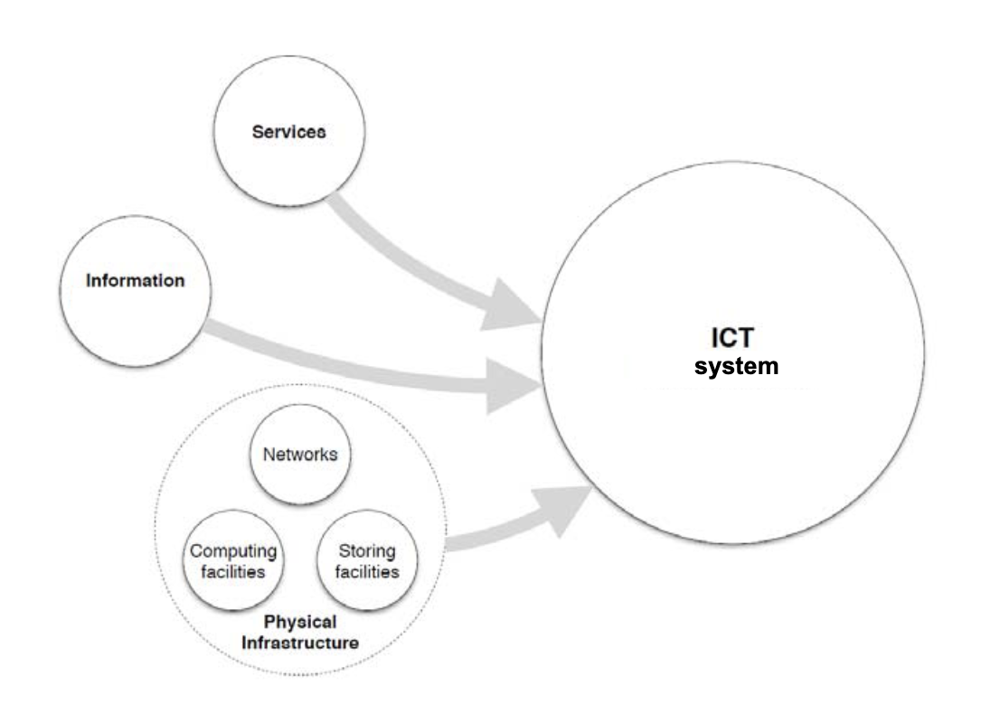

**Fysisk infrastruktur** inkluderer alt utstyr som er nødvendig for å realisere nettverk, og til
sørge for lagring og behandling av tjenestene som leveres.

IKT-systemene er i stadig endring, og nye **tjenester** krever ofte mer utstyr,
som må være tilgjengelig og tilgjengelig på nettet.

En annen trend er at store mengder **offentlig informasjon** samles inn og er tilgjengelig
fra nettet, som kart, GIS, værdata. Informasjonen brukes som innhold i
tjenester bygget på toppen.

************************************************Networks are not static************************************************

For å komplisere jobben ytterligere, må vi huske at nettverk ikke er statiske, og at tilstanden til nettverksressursene (belastningsnivå, arbeider/ned) har en tendens til å endre seg (raskt) over tid. Dette har ført til innføring av delvis autonom drift av nettverk. Dette betyr at nettet drives uten manuelle inngrep og tilpasser seg til endringer basert kun i henhold til veldefinerte regler. Risikoen for feil implementering eller konfigurasjon (de nevnte reglene) er betydelig og med
potensielt alvorlige konsekvenser. Nettverket må også beskyttes mot tilfeldige feil og forsettlige angrep.
Eksempler

1. Koblinger mislykkes: når en kobling mislykkes, må feilen oppdages, riktig avgjørelse må bli tatt og deretter gjennomføres. 
2. Flere noder mislykkes: generelt øker konsekvensene jo mer nettverk
elementer som er berørt, flere feil på grunn av en felles årsak eller angrep, eller
sammenfallende feil vil ha store konsekvenser
3. Angrepsnoder: hvis en angriper med ondsinnede hensikter har både tilgang til
ressurser, og kunnskap om strukturen, et koordinert angrep med enorme
konsekvens kan utføres

**************************The broad perspective**************************

IKT systemene må beskyttes mot et vidt spekter av forskjellige trusler;

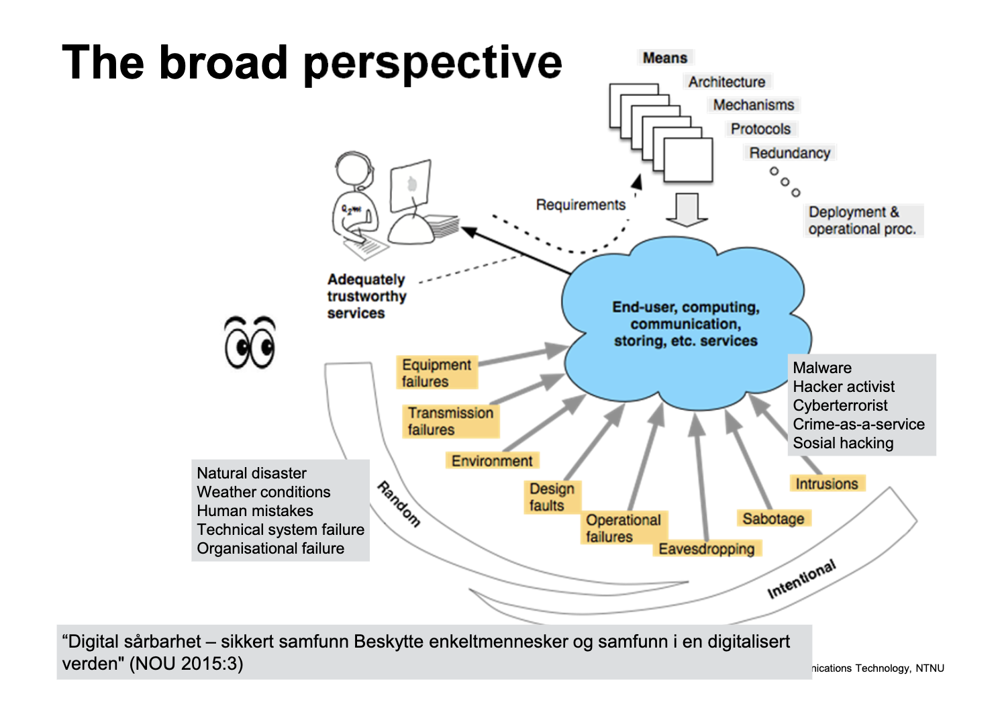

******A network of networks******

koordinere byggingen, designet, styringen til nettverket ende til ende, det er ikke bare en nettverksoperatør, men mange og alle har ulike policyer. De forskjellige levrandørene må samarbeide for å kunne tilby den beste tjenesten, samtidig som de konkurrerer om de samme kundene (********************A digital ecosystem********************). Før stolte alle på hverandre, men slik lengre og derfor trenger vi å være mer obs på sikkerhet. I digitale økosystem kan tjenester bli levert som et samarbeid mellom flere parter med ulike roller. Her er det ekstra viktig at de følger opp på sikkerheten. SLA blir brukt for å koordinere de ulike sidene ved slike samarbeid. 

Outsourcing: Noen skaffer en tjeneste fra en ekstern leverandør i stedet for å implementere denne selv. En tjeneste leveres alltid av enn provider, og brukes av en user. SLA er en avtale mellom provider og user.

# IKT-system og kritisk infrastruktur
*****✨Kritisk infrastruktur er de anlegg og systemer som helt nødvendige for å opprettholde samfunnets kritiske funksjoner som igjen dekker samfunnets grunnleggende behov og befolkningens trygghetsfølelse✨ -***** Direktoratet for samfunnssikkerhet og beredskap

Andre samfunnsfunksjoner kan være så avhengige av disse funksjonene, at svikt her vil forplante seg til andre deler av samfunnet, dette vil igjen gå på bekostning av befolkningen. EKS: svikt i forsyningen av elektrisk energi kan føre til bortfall av vann og avløp, finansielle tjenester, kommunikssjon, etc…

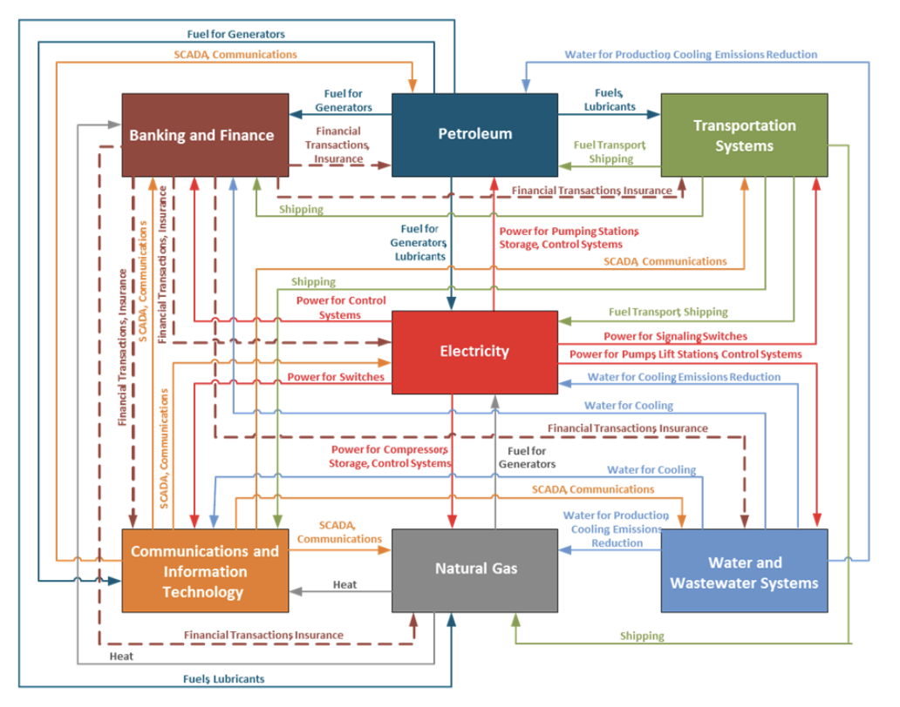

**********************************Elektronisk kommunikasjon (”Ekom”)**********************************

defineres som “kommunikasjon ved bruk av system for signaltransport som muliggjør overføring av lyd, tekst, bilder eller andre data vha elektromagnetiske signaler i fritt rom eller kabel der radioutstyr, svitsjer, annet koblings- og dirigeringsutstyr, tilhørende utstyr eller funksjoner inngår. 

Det eksisterer flere uavhengige ekomnett, som så og si er integrert med hverandre. 

I ekominfrastrukturen inngår; 
- kjernenett: løser trafikkbehoved mellom større byer og regioner 
- regionalnett: løser trafikkbehovet innad i større byer og regioner
- aksessnett: knytter utstyret hos brukeren til regionalnettet
- tjenestenett: en kombinasjon av kjernenett og regionalnett:
- drifts- og støttesystemer: IKT-systemer som overvåker og styrer ekomnett og tjenestenett

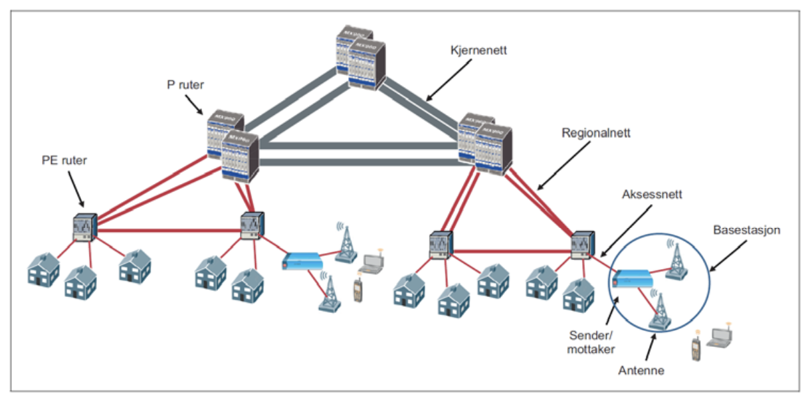

# Taksonomi

Når hele nettverket fungerer, hva mer trenger vi?

Det kan være lurt å tenke på:

- sikkerhet ⭐️
- personvern ⭐️
- funksjonalitet
- pålitelighet ⭐️
- vedlikehold
- brukervennlighet
- trygghet ⭐️
- ytelse ⭐️
- overlevelsesevne
- motstandsdyktighet
- etc

* ⭐️ de fem kjennetegnene på et sikkert og robust system

**********************************What is security?********************************** 

Betyr datasikkerhet, informasjonssikkerhet, IKT sykkerhet, cybersikkerhet, nettverkssikkerhet, computersikkerhet og IT-sikkerhet det samme? Nei

Vi har noen fundamentale sikkerhetsattributter; 

- Confidentiality: bare autoriserte personer/systemer kan se sensitiv eller gradert `informasjon`
- Integrity: forsikrer oss om at `informasjon (og tjenester)` ikke har blitt tuklet med
- Availability: nettverket skal være lett tilgjengelig for brukerne
- (Authenticity: handler om å få bekreftet at kilden er den du er ute etter)
- (Non-repudation: man kan ikke angre for det man har sendt)
- (Accountability: skal kunne spore alt tilbake til kilden)

EKSEMPEL: Skype-samtale

- Confidentiality: det skal ikke være mulig for utenforstående å lytte på samtalen
- Integrity: meldinger som blir sendt skal ikke tukles med
- Availability/Authenticity: søkefunksjonen kan kun brukes av registerte brukere
- Authenticity: brukere kan kun bli kontaktet av folk i kontaktlisten dems
- Non-repudation: brukere kan ikke slette meldinger de har sendt

*******Need to know vs need to share*******

Sikkerhet er en kompleks oppgave. Kravene er ofte rett frem, men måten å implementere de er vanskelige. 

************Personvern************

Hva er personvern? I denne sammenhengen innebærer personvern at individer/grupper selv har retten til å bestemme når, hvordan og i hvor stor grad informasjon som omhandler dem, blir kommunisert til andre. Det handler altså om å kunne kontrollere hva som blir gjort med dine personopplysninger. (***************************informasjon som kan brukes for å identifisere en person i en gruppe med mennesker).*************************** 

Vi har tre aktører innenfor dette:

- den registrerte
- behandlingsansvarlig
- databehandler

**************************Sikkerhet er ofte avhengig av en hemmelighet**************************

************************Sikkerhet vs brukervennlighet************************

Brukervennlighet er viktig, ellers vil brukerene finne snarveier for å unngå de tekniske problemene de opplever i forbindelse med sikkerheten. “PGP”

************************Sikkerhet vs personvern************************

Personvern handler om å beskytte informasjon om enkeltindivider. Sikkerhet handler om å beskytte all data, informasjon og generelt alle viktige komponenter i et IKT system.

************************Pålitelighet/Driftssikkerhet************************

Påliteligheten til et system er viktig slik at man med rette kan stole på tjenesten det leverer. 

Pålitelighet har tre hovedegenskaper: tilgjengelighet, pålitelighet(norsk har dårlig ordforråd) og vedlikeholdsvennlighet.

- Tilgjengelighet (availability) er evnen til å tilby tjenester på et gitt tidspunkt eller innenfor et gitt tidsintervall.
    - asymptotisk tilgjengelighet: sannsynligheten for at et system fungerer på et tilfeldig gitt tidspunkt
    - instantaneous tilgj.: sannsynligheten for at et system jobber på et gitt tidspunkt
    - interval tilgj.: gjennomsnittstilgjengeligheten over et gitt tidsintervall
- Pålitelighet (reliability) er evnen til å tilby uforstyrrede tjenester.
    - tiden til første gong et system svikter eller tiden til feil generelt
- Vedlikeholdsvennlighet (mailtainability) er evnen et system har til å bli gjenopprettet til en tilstand der det kan levere den nødvendige tjenesten.
    - modeller blir brukt for å beskrive den nødvendige tiden for å returnere et ureparerlig system til service

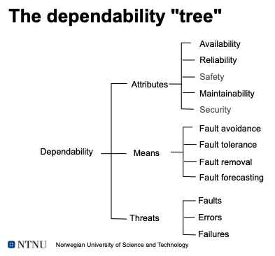

**************Sikkerhet**************

- et systems manglende evne til å ha en uønsket effekt på sitt mijlø
- å unngå katastrofale feil

Sikkerhet vs pålitelighet: et pålitelig system vil neppe slutte å fungere, mens et trygt system sannsynligvis ikkje forårsaker katastrofale feil

Safety vs security:

- safety: beskyttelse mot utilsiktede hendelser
- security: beskyttelse mot bevisste hendelser
- safety + security = safe

******************Is it safe to fly?******************

************Ytelse************

Kan defineres som et systems evne til å tilby de ressursene som trengs for å levere dens tjenester. Ytelsen avhenger av mengden ressurser i systemet og deres utnyttelse.

- kapasitet: def. som den maksimale lasten et gitt system klarer å håndtere pr tidsenhet
- gjennomstrømning: den delen av kapasiteten som blir brukt av brukerene
- forsinkelse: tiden det tar å få fullføre en tjeneste
- andre ting som: pakketap, tilstopping, servicetid, etc…

Pålitelighet vs ytelse

Høy tilgjengelighet/pålitelighet er ikke mye verdt hvis ytelsen er treg. Et system der feil aldri oppstår, men uten tilstrekkelige ressurser til å oppfylle ytelseskravene, anses ikke å være i fungerende tilstand.

******Qos (Quality of Service)******

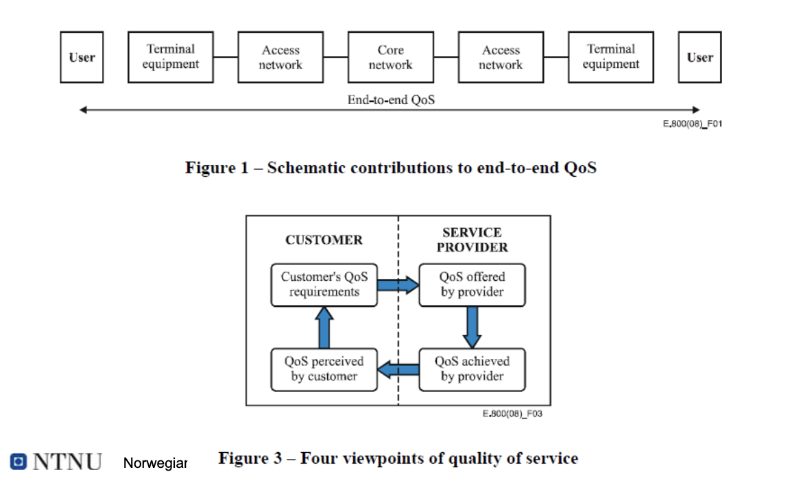

Def som “et sett med kvalitetskrav på den kollektive oppførselen til ett eller flere objekter”. 

Dig.kom.; QoS beskriver ytelsen til pakkesvitsjede nettverk. 

Internett og datastrømmning: QoS beskriver ytelsen til applikajsoner

************************************Funksjonelle vs ikke-funksjonelle krav************************************

Funksjonelle krav spesifiserer noe et system må gjøre, ikke-funksjonelle spesifiserer hvordan det burde oppføre seg

# Trusler

For å lage et sikker og robust IKT system må vi ta hensyn til et vidt spekter av trusler som kan påvirke systemet og dets leveranse. Når man skal analysere et system, burde man ta for seg alle mulige trusler. Dette gjelder både tilfeldige feil og bevisste angrep.

Innenfor pålitelighet snakker man ofte om faults, errors og failures.

- En “fault” er en defekt i et system;
    
    *programvarefeil, tilfeldige maskinvarefeil, minnebiter som sitter fast, utelatelsesfeil i    meldinger under dataoverføring*
    
- En “error” er et avvik fra den nødvendige driften av systemet. En “fault” kan føre til en “error”, som da vil gjøre “fault”en tydelig. En “fault” kan ligge i dvale/være passiv lenge før den viser seg som en “feil”. Når ein “fault” lager en “error” sies den å være aktiv.;
    
    *en software bug “fault” vil ikke være synlig for subrutinen der feilen hører hjemme blir kalt.* 
    
- En “failure” oppstår når systemet ikke klarer å utføre den nødvendige funksjonen, dvs levere dens tjenester.

Tilfeldige feil er vanligvis forbundet med maskinvarekomponenter. Siden alle fysiske komponenter er utsatt for feil, vil enhver IKT-infrastruktur være gjenstand for tilfeldige feil.
Deteksjon av feil gjøres vanligvis ved å kontrollere programvare.
Systemer kan ofte konstrueres for å tolerere eller til og med rette feil.

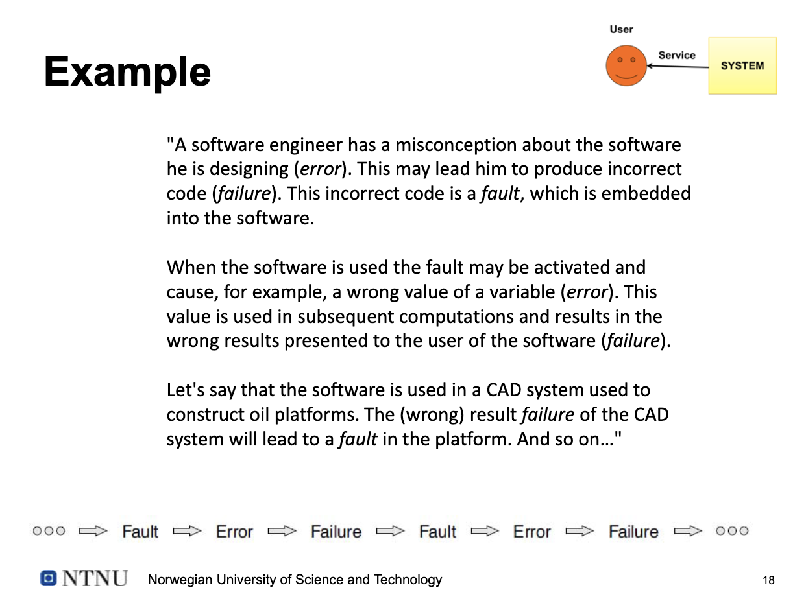

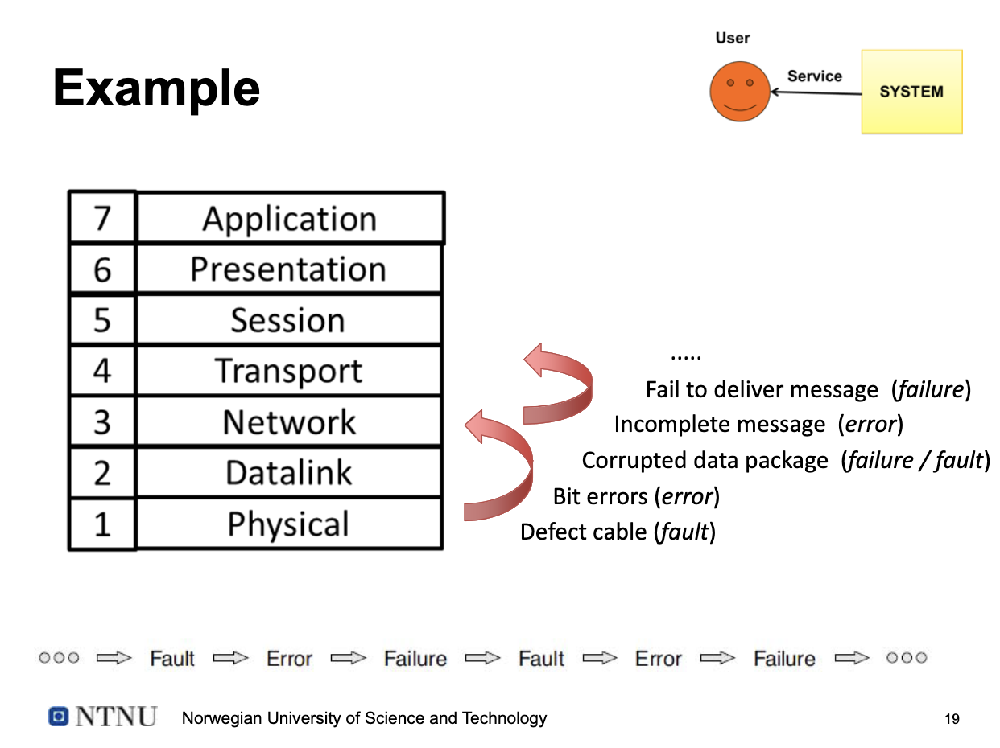

**Prosessen med en trussel-sårbarhet-hendelse**

Fra et sikkerhetsperspektiv er det vanlig å snakke om trusler, sårbarheter og hendelser.
I motsetning til feil x 3-patologien er det denne gangen et menneske involvert, som er årsaken til trusselen. Trusselen skjer derfor ikke «bare»; det ligger i mange tilfeller en klar intensjon bak.

*et virus (trussel) kan infisere en uopprettet datamaskin (sårbarhet), som da vil være ubrukelig for eieren (hendelsen).*

******Tilfeldige feil - “Systemsvikt”******

- Komponenter bryter sammen, ofte som følge av overbelastning
    - Kortslutning i elektronik
    - Elektronikk tar fyr
    - Harddisker slutter å fungere
    - Logiske feil i programkode
    - Produksjonsfeil i hardware
- Kan åpne opp for andre typer trusler

********************************************Utilsiktede feil - “Menneskelige feil”********************************************

- Mennesker gjør feil, selv med de beste intensjoner
    - Dokument sendt til feil mottaker
    - Uheldig sletting av filer
    - Inntasting av feil data i et system
    - Feilkonfig. av tjenester og systemer
        - Systemoppgraderinger feiler
    - Mister minnepinner
    - Søler kaffe på serveren
    - Fiberkabler blir gravd over

********************************Bevisste angrep********************************

- Skadevare
- Man-in-the-middle: angrep hvor angriperen skjult releer og potensielt endrer kommunikasjonen mellom to parter som tror de kommuniserer direkte
- Tjuvlytting
- Root kits
- Injection attacks
- Buffer overflow: angrep som utnytter sårbar programvare som tillater skriving utenfor allokert minne på datamaskinen (”Smashing the stach for fun and profit”)
- Passordangrep
- DoS
- Social engineering (Phishing): bruker menneske for å få informasjon om en organisasjon ellers dens systemer
- Tyveri
- Spionasje
- Utpressing
- Sabotasje, vandalisme, terrorisme

************Sårbarheter************

Svakheter i et system som tillater trusler å forårsake hendelser

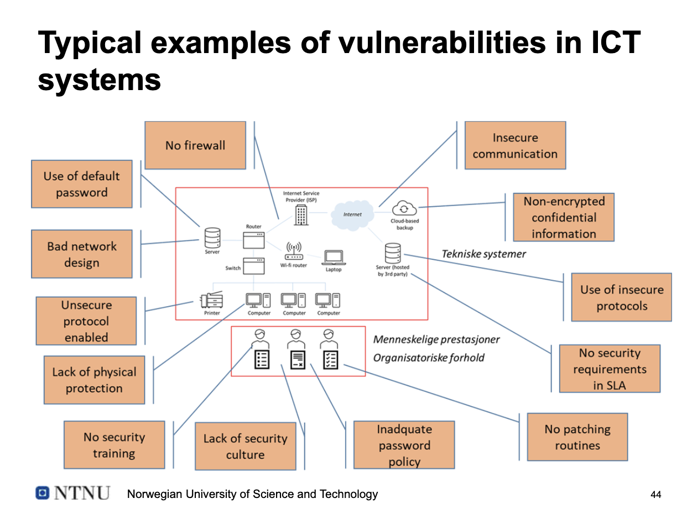
¨

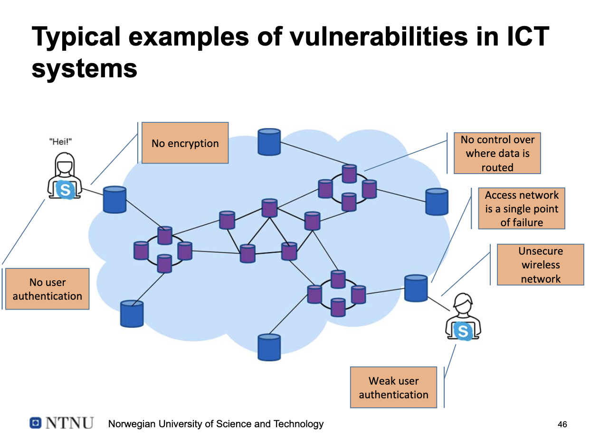

********************************Svakheter i den norske IKT infrastrukturen********************************

- Mange aktører
- Mer sentralitet
- Ikke dimensjonert for “peaks” i trafikken
- Mangel på redundans

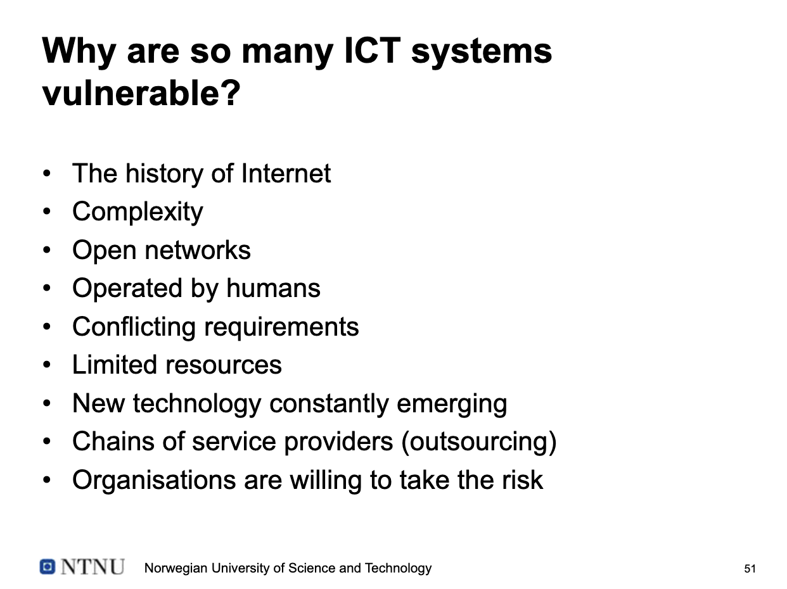

